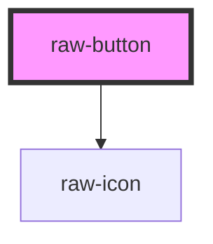

# raw-button

<!-- Auto Generated Below -->

## Properties

| Property | Attribute | Description | Type                                       | Default       |
| -------- | --------- | ----------- | ------------------------------------------ | ------------- |
| `icon`   | `icon`    |             | `string \| { name: string; src: string; }` | `undefined`   |
| `type`   | `type`    |             | `"primary" \| "secondary"`                 | `'secondary'` |

## Dependencies

### Depends on

- [raw-icon](../raw-icon)

### Graph

----------------------------------------------

*Built with [StencilJS](https://stenciljs.com/)*
