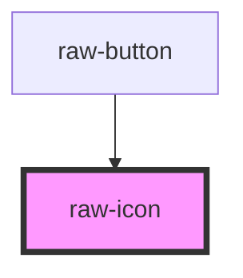

# raw-icon

<!-- Auto Generated Below -->

## Properties

| Property | Attribute | Description | Type                             | Default     |
| -------- | --------- | ----------- | -------------------------------- | ----------- |
| `icon`   | --        |             | `{ name: string; src: string; }` | `undefined` |
| `name`   | `name`    |             | `string`                         | `undefined` |

## Dependencies

### Used by

 - [raw-button](../raw-button)

### Graph

----------------------------------------------

*Built with [StencilJS](https://stenciljs.com/)*
